  <table width="100%">
    <tr>
      <td width="50%" valign="top">
        
          
        
      </td>
      <td width="50%" valign="top">
        
          
        
          
        
          
        
      </td>
    </tr>
  </table>

